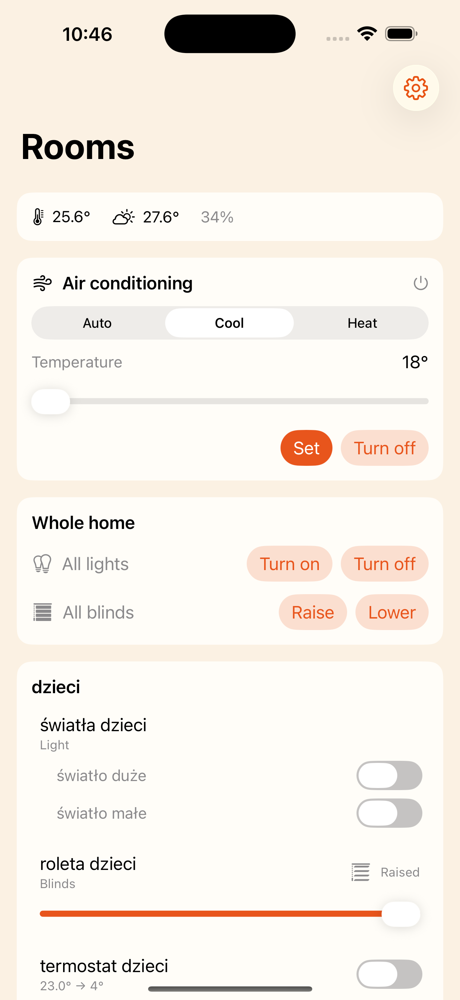
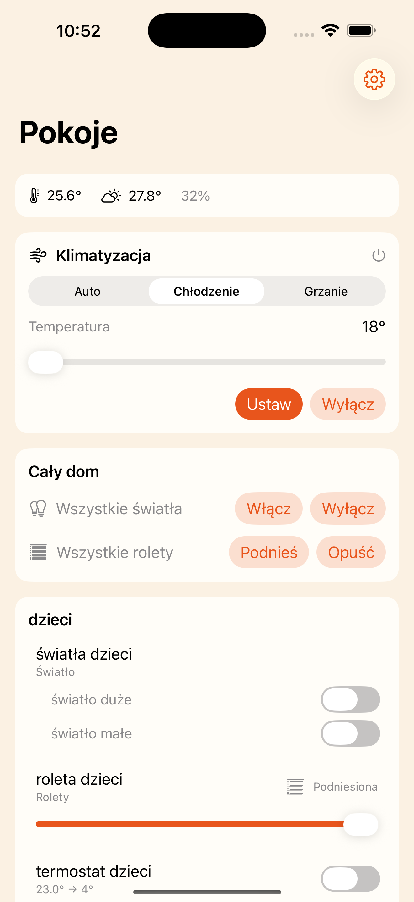
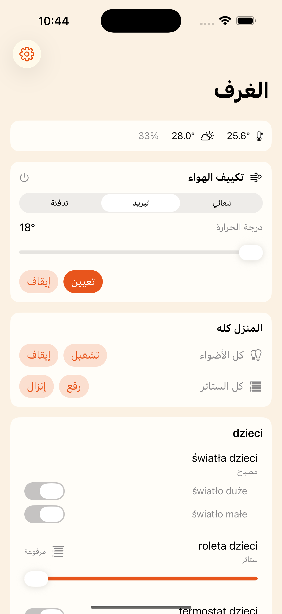
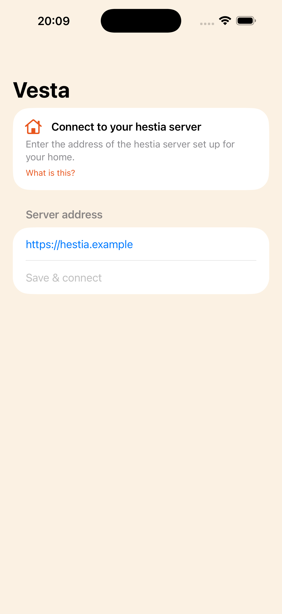

# Vesta

A native **SwiftUI** iOS client for [**hestia**](https://github.com/mateusz-klatt/hestia) — control your Keemple smart‑home from your phone, instead of a browser tab. Vesta talks to **your own** hestia server (you enter its URL), with a strongly‑typed API layer generated directly from hestia's OpenAPI contract.

> Status: feature‑complete; preparing the first TestFlight / App Store build. App Store name **Vesta** (`ie.klatt.vesta`) is reserved.

| Rooms | Polski | العربية (RTL) | Connect |
| --- | --- | --- | --- |
|  |  |  |  |

<sub>One‑tap room‑grouped control — lights (incl. multi‑gang), blinds, thermostats and A/C — with live updates over SSE, **45 languages** with full right‑to‑left layout, and bring‑your‑own‑server onboarding (no hard‑coded host).</sub>

## Why a separate app

hestia already ships a web dashboard, but a browser tab is a poor home‑control surface: no app icon, no Face ID gate, no widgets, no offline shell. Vesta is a small, fast, native SwiftUI app whose only job is to be a great phone client for a hestia server.

Like [Snapper iOS](https://github.com/mateusz-klatt/snapper-ios), **every user points Vesta at their own backend** — there is no hard‑coded server. Enter `https://hestia.example` (or a LAN address at home) on first launch; the URL is validated, persisted, and can be changed any time.

## Architecture

| Layer | Choice |
|-------|--------|
| UI | SwiftUI, Swift 6 (strict concurrency), iOS 26 |
| Project | [XcodeGen](https://github.com/yonaskolb/XcodeGen) (`project.yml` → `Vesta.xcodeproj`) |
| Backend URL | user‑entered, validated + persisted (`Config/BackendURLStore`) |
| API types | **generated** from `Vesta/openapi.json` by [apple/swift-openapi-generator](https://github.com/apple/swift-openapi-generator) at build time |
| Transport | `OpenAPIURLSession` (REST) + `URLSession.bytes` (the `/api/events` SSE stream) |

### Typed API pipeline

```
hestia (aiohttp + pydantic v2)  ──emit──▶  openapi.json  ──pin──▶  Vesta/openapi.json
                                                                        │
                                          swift-openapi-generator (build plugin)
                                                                        ▼
                                              Components.Schemas.* + Client  (generated, never committed)
```

`Vesta/openapi.json` is a **pinned copy** of the document hestia serves at `/openapi.json`. Refresh it with `make pull-spec` (then commit the diff); the Swift types regenerate on the next build, so the client cannot silently drift from the server contract. Until hestia finishes emitting its real spec, `Vesta/openapi.json` is a provisional contract hand‑modelled from the live API.

> hestia's `/api/events` is a Server‑Sent‑Events stream. OpenAPI has no streaming model, so the spec documents only the per‑event payload union (`HestiaEvent`); the stream itself is consumed with `URLSession.bytes` and decoded against the generated type.

## Build

```sh
brew install xcodegen      # one-time
make setup                 # xcodegen generate
make build                 # xcodebuild (simulator)
open Vesta.xcodeproj       # or work in Xcode
```

The first build resolves the swift-openapi packages and runs the generator plugin.

## Licensing

Vesta is **Apache‑2.0** (see `LICENSE` / `NOTICE`). It is an independent network client of hestia and contains none of hestia's source, so hestia's AGPL‑3.0 does not reach it. Apache‑2.0 (over GPL/AGPL) also keeps App Store distribution clean and adds an explicit patent grant.

## Related

- [hestia](https://github.com/mateusz-klatt/hestia) — the server this app controls (Python, AGPL‑3.0)
- [snapper-ios](https://github.com/mateusz-klatt/snapper-ios) — sibling native SwiftUI client (trading), the production reference for this app's shape
